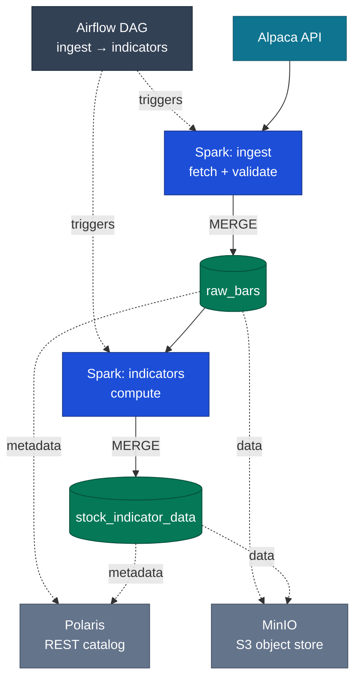

# StockAlgo

StockAlgo ingests raw OHLCV bars for the full US equities universe (~9,700 symbols) from the Alpaca API and computes eleven technical indicators from them in distributed Spark — including recursive and stateful ones such as RSI, ADX, and Parabolic SAR — rather than pulling pre-computed values from a vendor. The results are stored as Apache Iceberg tables. It runs on a two-node, bare-metal Kubernetes cluster I built and operate in a homelab: Spark handles compute, Airflow handles scheduling, Polaris serves as the catalog, and MinIO provides object storage.

This is the second iteration of the project. [Version 1](./legacy) implemented the same pipeline on a normalized MySQL database (AWS RDS), with all ETL and indicator logic in stored procedures and scheduled events; that version holds the bulk of the relational data-modeling work. Version 2 re-implements the same problem on the stack I would choose today — distributed Spark, a lakehouse table format, and Kubernetes in place of managed RDS. See [Lineage](#lineage) for the full comparison.

The pipeline is granularity-agnostic — the bar interval is a request parameter, not an architectural choice, so it extends to intraday without redesign.

## Architecture



The pipeline is two Spark-on-Kubernetes jobs chained by a single Airflow DAG (`ingest >> indicators`). Each job is a SparkApplication; the Spark Operator provisions a driver and a set of executor pods across both nodes and removes them on completion. The driver handles catalog planning and commits against Polaris; the executors read and write Parquet to MinIO over the S3 API. All object-store and catalog credentials are supplied by Kubernetes Secrets; none are committed to this repository.

**Ingest** retrieves bars from Alpaca in batches (batch size is a command-line argument), unions them, and derives an `is_valid` flag by comparing each bar against its neighbours using Spark window functions. It then MERGEs the result into the `raw_bars` Iceberg table on `(symbol, time_stamp)`. Validation occurs before the write rather than after: for a full historical batch, every neighbouring row is already present, so there is no reason to write first and flag later. The write-then-flag pattern suits OLTP workloads, not this one.

**Indicators** reads the validated bars and computes eleven technical indicators: SMA, EMA, MACD, RSI, ATR, ADX/DMI, OBV, Chaikin A/D Line, Bollinger Bands, Rate of Change, and Parabolic SAR (VWAP comes directly from the Alpaca feed and is not computed here). Most are expressed as Spark window functions; the recursive ones — EMA, MACD, RSI, ADX, and Parabolic SAR — are computed per symbol via `applyInPandas`, with MACD and ADX composing the EMA primitive. Several indicators are implemented in both Spark SQL and the DataFrame API. The results MERGE into `stock_indicator_data`.

Both jobs run from the same container image, where the pipeline is installed as a Python package (`src` layout) and invoked through a console entrypoint; an `action` argument selects ingest or indicators.

## Stack

- Apache Airflow (`SparkKubernetesOperator`) for orchestration
- Apache Spark 4.0.0 / PySpark on Kubernetes, via the Spark Operator
- Apache Iceberg 1.10.1 for the table format (copy-on-write MERGE)
- Apache Polaris as the REST catalog
- MinIO for S3-compatible object storage
- Kubernetes (kubeadm 1.32), Calico CNI
- Docker image `marcpaulthecoder/stockalgo` (Spark 4.0.0, Python 3.10, Java 17)
- Alpaca market-data API as the source

## Data model

All tables use the Iceberg format, in the `stockalgo` catalog under the `market` namespace.

- `company_info` — the symbol universe, with an `active` flag
- `raw_bars` — validated OHLCV bars with an `is_valid` column
- `stock_indicator_data` — one row of indicators per valid bar

## Lineage

[Version 1](./legacy) is the original implementation, and it holds the majority of the relational data-modeling work. It retrieved data from thirteen Alpha Vantage endpoints using an `asyncio` and `multiprocessing` worker pool (25 workers) and loaded it into a normalized MySQL 8 schema: more than 35 tables across raw, processed, and indicator tiers, hash-partitioned into 100 partitions on `StockID`, with over 325 million rows in the primary table and more than 1.6 billion across all tables. ETL and indicator computation ran entirely in the database, in stored procedures driven by scheduled events. Power BI consumed the results through presentation views.

Version 1 was not a prototype; it ran end to end at that scale. It also hand-built the mechanisms a lakehouse provides natively, and Version 2 is a deliberate re-platforming in which each managed component replaces something I had already implemented by hand:

| Version 2 (managed) | Version 1 (hand-built in MySQL) | The v1 artifact |
|---|---|---|
| Airflow scheduler + DAG dependencies | scheduled `EVENT`s gated by `GET_LOCK` / `IS_FREE_LOCK` to prevent overlapping runs | `ProcessRawDataThread0..3` |
| Spark partitioning and shuffle | a modulo partition dispatcher over 100 hash partitions | `processRawTableLoop(threadCount, threadIndex)` |
| Iceberg ACID snapshots | a hand-managed raw-to-processed staging-and-validation pipeline | `rawFinancialDataToFinancialData` |
| Spark `lag()` window functions | explicit parent-child row linkage | `CreateFinancialDataParentChild` |
| `applyInPandas` for stateful indicators | stateful stored procedures | `CreateUpdateSarSlope` |
| Distributed Spark compute | stored-procedure indicators over ~280M-row tables | `AnalyzeMACD`, `AnalyzeBoilerBand`, … |

The same indicators (Bollinger Bands, MACD, Chaikin, ADX/DMI, Parabolic SAR) were first written as MySQL stored procedures; in v2 they are Spark jobs. Version 1 still runs on this same cluster as a primary/replica MySQL StatefulSet with GTID-based replication.

Every tool choice in v2 is grounded in a tradeoff made the hard way in v1. The complete schema, ERD, and source are in [`legacy/`](./legacy) — including the scheduled-event scheduler and `GET_LOCK` concurrency control, the hash-partitioned 325-million-row table, the stored-procedure ETL, and the centralized `SQLEXCEPTION` error logging.

## Engineering notes

The most substantial engineering in the build:

- **Recursive indicators on one reused primitive.** EMA, MACD, RSI, ADX, and Parabolic SAR are all path-dependent — each value depends on the previously computed one, which a Spark window cannot express (a window cannot reference its own output). I built a single parameterized EMA primitive that runs per symbol via `applyInPandas` and delegates the recursion to pandas' `ewm()` (optimized C, not a Python loop). MACD is three calls to it — fast EMA, slow EMA, and an EMA of the MACD line; ADX reuses the same primitive for Wilder's smoothing, once you recognize that Wilder's recursive average is an EMA with `alpha = 1/period`, so `+DI`, `-DI`, and ADX are all that one primitive at `alpha = 1/14`. RSI sits on a sibling rolling-mean primitive. Parabolic SAR is the hardest — four interdependent state variables (SAR, extreme point, acceleration factor, trend direction) with conditional trend reversals — so I vectorize the multi-row seed in Spark (`row_number`, bounded min/max, `sign`, `lag`) and drop into a per-symbol pandas loop only for the irreducibly stateful recursion. The shared tradeoff is memory: `applyInPandas` lands a whole symbol's rows on one executor, so a symbol must fit in executor memory.
- **Bar validation as a distributed window operation.** Each bar is validated against its own temporal neighbours before it is written: for high, low, and close, the value is compared against the previous and next bar for that symbol over a per-symbol, time-ordered window, and a field passes if it is within tolerance of *either* neighbour — so a single bad tick or a one-sided gap does not cascade into false rejections. The per-field checks are combined into one `is_valid` flag, computed and written in the same pass, and kept null-safe under Spark 4's ANSI mode with `try_divide`. I then verified the result by arithmetic rather than assumption: the number of valid bars equalled the number of indicator rows to the row (1,033,455 − 28,279 = 1,005,176), which confirmed the downstream stateful SAR UDF changed no row counts and cleanly separated symbols that returned no data from symbols whose every bar failed validation.
- **A self-hosted platform, built and operated end to end.** The entire lakehouse runs on hardware I own, with no managed services: Spark, Iceberg, Polaris, MinIO, Airflow, and a MySQL StatefulSet are all deployed by me on a two-node `kubeadm` cluster I built, with Calico for the pod network and NFS for shared storage. The cluster runs both the Spark jobs and the v1 MySQL database as a primary/replica StatefulSet with GTID-based replication — where an init container selects each pod's primary or replica config by hostname — and the Iceberg schema is bootstrapped idempotently by a small DDL runner I wrote. A representative bring-up problem: `calico-node` crash-looped because Calico's first-found address autodetection chose the physical NIC, which carries no IPv4 — the address lives on a bridge interface — and pinning Calico to the bridge resolved it.

## Infrastructure

The cluster runs on two physical machines rather than cloud instances:

- **backend-5090** — Ryzen 9 9950X, 256 GB RAM, RTX 5090. Control plane and worker.
- **frontend-7900xtx** — Ryzen 9 7900X, 128 GB RAM, RX 7900 XTX. Worker.

They are connected over 25 GbE at MTU 9000 on a dedicated VLAN, with Calico providing the pod network and NFS providing shared storage.

## Repository layout

```
├── src/stockalgo/          # the pipeline package
│   ├── main.py             #   entrypoint: selects ingest or compute_indicators
│   ├── connections.py      #   Spark session + Alpaca client
│   ├── ingest.py           #   fetch, validate, MERGE -> raw_bars
│   ├── indicators.py       #   the 11 indicators, MERGE -> stock_indicator_data
│   └── apply_ddl.py        #   Iceberg table bootstrap
├── dags/                   # Airflow DAG (ingest >> indicators)
├── ddl/                    # table DDL
├── docker/                 # Dockerfile + requirements
├── yaml/                   # K8s manifests: SparkApplications, MinIO, Polaris, RBAC, NFS
├── tests/                  # Iceberg smoke test
├── legacy/                 # StockAlgo v1 (MySQL / RDS) — see Lineage
└── pyproject.toml
```

## Running the pipeline

This assumes a Kubernetes cluster with the Spark Operator, Polaris, MinIO, and Airflow already running (manifests are in `yaml/`), along with Secrets for the Alpaca, MinIO, and Polaris credentials.

```bash
# build and push the image
docker build -f docker/Dockerfile -t marcpaulthecoder/stockalgo:latest .
docker push marcpaulthecoder/stockalgo:latest

# bootstrap the Iceberg tables
kubectl apply -f yaml/apply-ddl.yaml

# trigger the Airflow DAG (dags/stockalgo_ingest.py), which runs ingest >> indicators,
# or apply the SparkApplications directly:
kubectl apply -f yaml/stockalgo-ingest.yaml
kubectl apply -f yaml/stockalgo-indicators.yaml
```
