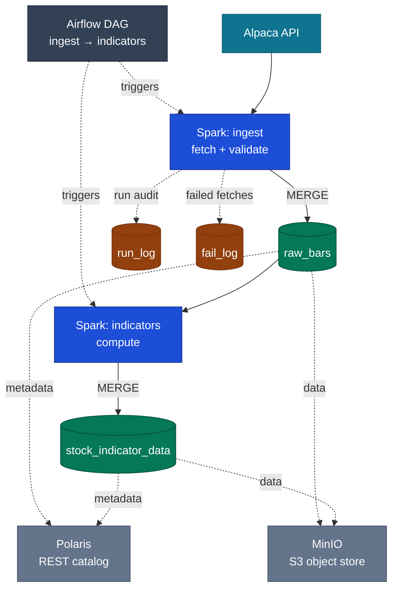

# StockAlgo

StockAlgo pulls raw OHLCV bars for the full US equities universe, about 10,500 symbols, from the Alpaca API and computes eleven technical indicators on top of them in distributed Spark. Several of those indicators are recursive, including RSI, ADX, and Parabolic SAR, so they are computed from the raw bars rather than bought pre-computed from a vendor. The results are stored as Apache Iceberg tables. Everything runs on a two-node bare-metal Kubernetes cluster I built and operate at home, with Spark for compute, Airflow for scheduling, Polaris as the catalog, and MinIO for object storage. A full refresh covers about 3.6 million daily bars and finishes in roughly two minutes end to end: about 40 seconds to ingest and validate, and a little over a minute to compute the indicators.

This is the second build of the project, and the first is why it looks the way it does. [Version 1](#lineage) solved the same problem in a normalized MySQL database on RDS: 35+ tables, over 325 million rows in the primary table and 1.6 billion across the schema, with all of the ETL and indicator logic hand-written as stored procedures on scheduled events. Version 2 rebuilds that same pipeline on the stack I would choose today: distributed Spark, a lakehouse table format, and Kubernetes in place of managed RDS. Because every piece of it maps back to something I had already built by hand, I can speak to each choice and to the alternative it replaced. That mapping is the part of the project I find most interesting, and it is laid out in [Lineage](#lineage).

The bar interval is just a request parameter, so the same pipeline handles intraday data without a redesign.

## Architecture



The pipeline is two Spark-on-Kubernetes jobs, chained by a single Airflow DAG (`ingest >> indicators`). Each job is a SparkApplication. The Spark Operator brings up a driver and a set of executor pods across both nodes and tears them down once the job finishes. The driver handles catalog planning and commits against Polaris, and the executors read and write Parquet to MinIO over the S3 API. Credentials for the object store and the catalog all come from Kubernetes Secrets and are never committed to the repo.

**Ingest** fetches from Alpaca and writes the bars in a single distributed pass. The symbol list is repartitioned across the executors, and the fetch itself runs inside `mapInPandas`, so each executor pulls bars only for its own slice of symbols. There is no serial fetch loop on the driver. Validation happens in the same pass: each bar is checked against its neighbours and given an `is_valid` flag before it is written, which works because a full historical batch already has every neighbour present. The single cached result is then split into three idempotent Iceberg MERGEs. Valid bars go to `raw_bars`, keyed on `(symbol, time_stamp)`; failed symbols go to `fail_log`; and one summary row per run goes to `run_log`.

**Indicators** reads the validated bars, taking only `is_valid` rows and only active symbols through a semi-join to `company_info`, and computes eleven indicators: SMA, EMA, MACD, RSI, ATR, ADX/DMI, OBV, Chaikin A/D Line, Bollinger Bands, Rate of Change, and Parabolic SAR. VWAP comes straight from the Alpaca feed. How each indicator is computed depends on what it needs. The pure window indicators (SMA, OBV, Bollinger Bands, Rate of Change) are done entirely in Spark. The stateful ones (EMA, MACD, RSI, ATR, ADX, Chaikin A/D, Parabolic SAR) are finished in a single `groupBy("symbol").applyInPandas` pass, after Spark has built the window inputs each of them needs. Since every step is keyed on `symbol`, the whole stage resolves in one shuffle, and the result is merged into `stock_indicator_data` on `(symbol, time_stamp)`.

Both jobs run from the same container image. Inside it, the pipeline is installed as a Python package in a `src` layout and invoked through a console entrypoint with three `argparse` subcommands: `ingest`, `compute_indicators`, and `apply_ddl`, the last being a one-time table bootstrap. Each subcommand parses only its own arguments. `ingest` takes the Airflow `run_id`, a start date, and an optional repartition size; `compute_indicators` also declares a `run_id`, which is reserved for indicator-stage audit logging that I have not wired up yet.

## Lineage

I built this pipeline twice. [Version 1](./legacy) is the original, and it holds most of the relational data-modeling work. It pulled from thirteen Alpha Vantage endpoints through an `asyncio` and `multiprocessing` worker pool of 25 workers into a normalized MySQL 8 schema: 35+ tables across raw, processed, and indicator tiers, hash-partitioned into 100 partitions on `StockID`, with over 325 million rows in the primary table and 1.6 billion across the whole schema. The ETL and every indicator ran inside the database, written as stored procedures on scheduled events, and Power BI read the results through presentation views.

It was not a prototype. It ran end to end at that scale, and it hand-built the things a lakehouse gives you for free. Version 2 maps onto it piece by piece:

| Version 2 | Version 1 (hand-built in MySQL) | The v1 artifact |
|---|---|---|
| Airflow scheduler + DAG dependencies | scheduled `EVENT`s gated by `GET_LOCK` / `IS_FREE_LOCK` to stop overlapping runs | `ProcessRawDataThread0..3` |
| Spark partitioning and shuffle | a modulo dispatcher over 100 hash partitions | `processRawTableLoop(threadCount, threadIndex)` |
| Iceberg ACID MERGE | a hand-managed raw-to-processed staging pipeline with duplicate detection | `rawFinancialDataToFinancialData` |
| Spark `lag()` window functions | explicit parent-child row linkage | `CreateFinancialDataParentChild` |
| `applyInPandas` for stateful indicators | stateful stored procedures | `CreateUpdateSarSlope` |
| distributed Spark compute | stored-procedure indicators over ~280M-row tables | `AnalyzeMACD`, `AnalyzeBoilerBand`, … |
| `fail_log`: failed fetches land as rows, never thrown | a `CONTINUE HANDLER FOR SQLEXCEPTION` in every procedure, logging the error to one table | `errorlog` |
| `run_log`: per-run ledger, keyed for idempotent retry | a per-transformation row stamped with start time, end time, and row count | `raw_data_to_data_transaction` |

Most of these are straight replacements, a managed component swapped in for something I had hand-rolled. Two of them I kept on purpose. Error logging and a transaction ledger were the right idea in Version 1, and Version 2 rebuilds both for a distributed job: a failed fetch lands in `fail_log` as rows rather than crashing the run, and `run_log` records and reconciles each run so that an Airflow retry is safe to issue. The granularity did shift, from per-symbol to per-run, because the execution model shifted with it and turned a queue of per-symbol workers into a single distributed job. One difference there is deliberate. In v1 an empty transaction was deleted; in v2 a zero-success run is kept, because that row is how a silent failure becomes visible. The full schema, the ERD, and the source are all in [`legacy/`](./legacy).

## Stack

- Apache Airflow (`SparkKubernetesOperator`) for orchestration
- Apache Spark 4.0.0 / PySpark on Kubernetes, via the Spark Operator
- Apache Iceberg 1.10.1 for the table format (copy-on-write MERGE)
- Apache Polaris as the REST catalog
- MinIO for S3-compatible object storage
- Kubernetes (kubeadm 1.32), Calico CNI
- Docker image `marcpaulthecoder/stockalgo` (Spark 4.0.0, Python 3.10, Java 17)
- Alpaca market-data API as the source

## Data model

All tables are Iceberg, in the `stockalgo` catalog under the `market` namespace.

- `company_info`: the symbol universe, with an `active` flag
- `raw_bars`: validated OHLCV bars with an `is_valid` column
- `stock_indicator_data`: one row of indicators per valid bar
- `run_log`: one row per run, keyed on the Airflow `run_id`, recording the start and end, the date range fetched, the number of bars that succeeded, and the per-task chunk size
- `fail_log`: per-(run, symbol) fetch failures, with the error and the time it occurred

## Engineering notes

A few parts I would point to:

- **Every indicator in one shuffle.** The obvious approach is one `applyInPandas` per indicator. With eleven indicators that is roughly a dozen separate per-symbol passes, each carrying its own shuffle and its own round-trip between the JVM and pandas. I collapse all of it into a single pass. The window indicators (SMA, OBV, Bollinger Bands, Rate of Change) are computed in Spark. The two purely recursive indicators (EMA, MACD) are computed in pandas. The remaining five (RSI, ATR, Chaikin A/D, ADX, Parabolic SAR) have their inputs prepared in Spark and are then finished in pandas. Because every step is keyed on `symbol`, the whole computation needs only one exchange, and a single `groupBy("symbol").applyInPandas` computes every pandas-side indicator together. The speedup comes from removing those repeated round-trips; the amount of data being moved was never the constraint. Most of the pandas work reduces to one primitive. EMA, MACD, RSI, and ADX are exponential recursions that a Spark window cannot express, so they delegate to pandas' `ewm()`. MACD is three EMA calls, and ADX is the same EMA at `alpha = 1/14`, since Wilder's smoothing is just an EMA. Parabolic SAR is the one genuine row-by-row loop, so I vectorize its seed in Spark and let only the recursion itself run in pandas. The trade-off is memory. `applyInPandas` brings an entire symbol's history onto one executor, so a single symbol has to fit in that executor's memory.

- **Ingest runs in one pass and records its own provenance.** The fetch from Alpaca happens on the executors, inside `mapInPandas`, with each task responsible for its own slice of the symbol list. The work is dominated by the fetch rather than by computation, which is why spreading it across executors is what matters. A single cached result then feeds three idempotent MERGEs, into `raw_bars`, `fail_log`, and `run_log`. Failures are returned as rows rather than raised, so a single dead symbol out of ten thousand cannot abort the run; it lands in `fail_log` with its error message and a timestamp. Each table is written on its own key, which lets an Airflow retry reconcile a run in place without creating duplicates. And `run_log` keeps the timing, the date range, and the succeeded-bar count, which together answer the basic question of whether last night's run actually worked.

- **Bars are validated against their neighbours.** For each symbol, the high, low, and close of every bar are compared against the bars immediately before and after it, over a window ordered by time. A field is accepted if it falls within tolerance of either neighbour, which keeps a single bad tick or a one-sided gap from cascading into a run of false rejections. The individual checks combine into one `is_valid` flag, written during the same pass and kept null-safe under Spark 4's ANSI mode with `try_divide`. The rejected bars are informative in themselves. Of about 3.6 million bars, 105,662 fail validation, and 103,336 of those, or 97.8 percent, are zero-volume instruments that Alpaca still emits bars for, such as warrants, rights, units, and delisted paper. The remainder are genuine anomalies, plus a few single-bar symbols that have no neighbour to be tested against.

- **The platform is self-hosted from top to bottom.** There are no managed services anywhere in it. Spark, Iceberg, Polaris, MinIO, Airflow, and a MySQL StatefulSet all run on a two-node `kubeadm` cluster that I built and operate myself, using Calico for the network and NFS for shared storage. The same cluster also runs the Version 1 MySQL database, as a primary/replica StatefulSet with GTID replication in which an init container selects each pod's role by hostname, while a small DDL runner I wrote bootstraps the Iceberg schema idempotently. The bring-up was not free. As one example, `calico-node` kept crash-looping because its address autodetection had chosen the physical NIC, which carries no IPv4 address; the address actually lived on a bridge interface, and pinning Calico to that bridge resolved it.

## Infrastructure

The cluster runs on hardware I own rather than on cloud instances:

- **backend-5090**: Ryzen 9 9950X, 256 GB RAM, RTX 5090. Control plane and worker.
- **frontend-7900xtx**: Ryzen 9 7900X, 128 GB RAM, RX 7900 XTX. Worker.
- **TrueNAS NAS**: the persistence tier. Every stateful component (MinIO's object store, the MySQL StatefulSet, Polaris's catalog database, and Airflow's metadata, DAGs, and logs) lives on NFS volumes backed by mirrored NVMe, with a mirrored-HDD tier behind that for backups.

The compute nodes themselves hold no persistent state, so any pod can be rescheduled to the other node without losing data. They reach the NAS over 25 GbE at an MTU of 9000 on a dedicated VLAN, and Calico provides the pod network.

## Repository layout

```
├── src/stockalgo/          # the pipeline package
│   ├── main.py             #   entrypoint: ingest / compute_indicators / apply_ddl subcommands
│   ├── connections.py      #   Spark session + Alpaca client
│   ├── ingest.py           #   executor-side fetch, validate, MERGE -> raw_bars / run_log / fail_log
│   ├── validate_bars.py    #   neighbor validation -> is_valid flag
│   ├── indicators.py       #   the 11 indicators, MERGE -> stock_indicator_data
│   ├── indicator_math.py   #   pure pandas math for the recursive indicators (unit-tested)
│   └── apply_ddl.py        #   Iceberg table bootstrap
├── dags/                   # Airflow DAG (ingest >> indicators)
├── ddl/                    # table DDL
├── docker/                 # Dockerfile + requirements
├── yaml/                   # K8s manifests: SparkApplications, MinIO, Polaris, RBAC, NFS
├── tests/                  # pytest
│   ├── unit/               #   pure pandas, indicator math
│   └── spark/              #   local-session Spark, bar validation
├── legacy/                 # StockAlgo v1 (MySQL / RDS), see Lineage
└── pyproject.toml
```

## Testing

The indicator math and the validation logic are covered by a pytest suite:

- **`tests/unit`**: pure-pandas tests for the recursive math, covering EMA in both `adjust` modes, the rolling-mean primitive, and Parabolic SAR's trend reversal and acceleration-factor cap. They use no Spark and run in milliseconds.
- **`tests/spark`**: a local `local[2]` Spark session covering neighbour validation, including the bad-tick non-cascade and cross-symbol isolation, and the idempotency of the `raw_bars` MERGE.
- **`tests/integration`**: gated behind a marker, run against a real Polaris and MinIO catalog in-cluster.

The default run skips the integration tier (`addopts = -m 'not integration'` in `pyproject.toml`):

```bash
pytest                  # unit + local-Spark
pytest -m integration   # integration tier, in-cluster
```

## Running the pipeline

This assumes a Kubernetes cluster already running the Spark Operator, Polaris, MinIO, and Airflow, with manifests in `yaml/`, along with Secrets for the Alpaca, MinIO, and Polaris credentials.

```bash
# build and push the image
docker build -f docker/Dockerfile -t marcpaulthecoder/stockalgo:latest .
docker push marcpaulthecoder/stockalgo:latest

# bootstrap the Iceberg tables (one time)
kubectl apply -f yaml/stockalgo-apply-ddl.yaml

# trigger the Airflow DAG (dags/stockalgo_ingest.py), which runs ingest >> indicators,
# or apply the SparkApplications directly:
kubectl apply -f yaml/stockalgo-ingest.yaml
kubectl apply -f yaml/stockalgo-indicators.yaml
```
